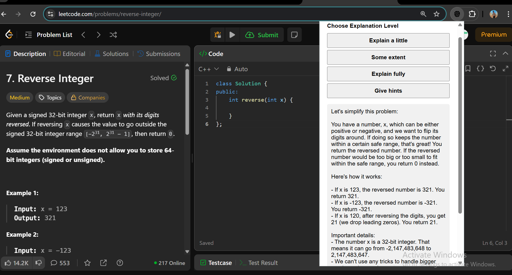

# cp_helper_extension
CP Helper is a powerful and lightweight Chrome extension designed to assist competitive programmers by simplifying and explaining coding problems directly from platforms like LeetCode, Codeforces, CSES, and more.
CP Helper is a powerful and lightweight Chrome extension designed to assist competitive programmers by simplifying and explaining coding problems directly from platforms like LeetCode, Codeforces, CSES, and more.

Just highlight or let the extension extract the problem text, and get:

✏️ Lite summary – One-liner overview of the problem

🧑‍🎓 Mid-level explanation – Beginner-friendly rewording

🧒 Full explanation – Easy-to-understand version for all ages

💡 Hints – Subtle guidance without spoiling the solution

This extension uses an AI-powered backend (FastAPI + OpenAI) to generate high-quality explanations and hints instantly.

🔧 Features
One-click AI-powered problem explanation

Easy-to-understand summaries and hints

Supports multiple competitive coding platforms

No need to copy-paste code

Free and open-source

## Instructions to setup
Download the ZIP file from:
[👉 Link to ZIP here]

Extract the ZIP on your computer.

Open Chrome and go to
🔗 chrome://extensions/

Turn on Developer Mode (top-right switch)

Click “Load unpacked”

Select the extracted folder (cp-helper-extension/)

